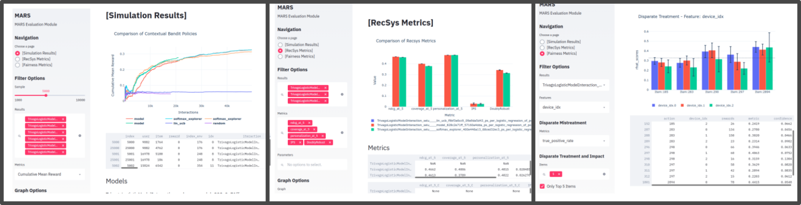

######################
MARS-Gym - Experiments
######################

This repository includes all experiments of paper **'MARS-Gym: A Gym framework to model, train, and evaluate recommendation systems for marketplaces'**  and can be used for reproducibility or example of framework usage. 

MARS-Gym Repo: https://github.com/marlesson/mars-gym

Setup
#####

Dependencies
------------

-  python=3.6.7
-  mars-gym=0.0.1
-  spark=2.4.6

Install
-------

::

  conda env create -f environment.yml
  conda activate mars-gym-experiments

Dataset
#######

Trivago organized the ACM RecSys Challenge in 2019. For this competition, it provided a dataset that consists of session logs with 910k samples. Each session contains a sequence of interactions between a user and the platform. They can represent different actions, such as rating, get item metadata (info, image, and deals), sort list, search for a destination or point of interest. In addition to the user session information, the dataset also provides different item metadata that characterize the hotels. 

The dataset can be found in https://recsys.trivago.cloud/challenge/dataset/, it's importante that is in ``./trivago/dataset/trivagoRecSysChallengeData2019_v2``

Usage
#####

A simple experiment can be run directly from Mars-Gym:

Training: 

.. code:: bash

  mars-gym run interaction \
  --project trivago.config.trivago_experiment \
  --recommender-module-class trivago.model.SimpleLinearModel \
  --recommender-extra-params '{"n_factors": 50, "metadata_size": 147, "window_hist_size": 10, "vocab_size": 120}' \
  --bandit-policy-class mars_gym.model.bandit.EpsilonGreedy \
  --bandit-policy-params '{"epsilon": 0.1}' \
  --data-frames-preparation-extra-params '{"filter_city": "Chicago, USA", "window_hist":10}' \
  --learning-rate 0.001 \
  --optimizer adam \
  --batch-size 200 \
  --epochs 250 \
  --num-episodes 7 \
  --val-split-type random \
  --obs-batch-size 1000 \
  --full-refit 

Evaluation: 

.. code:: bash

  mars-gym evaluate interaction \
  --model-task-id InteractionTraining____mars_gym_model_b___epsilon___0_1__472bcd526f \
  --offpolicy \
  --fairness-columns '["device_idx", "city_idx", "accessible parking", "accessible hotel", "hotel", "house / apartment", "childcare", "family friendly"]'

There are many scripts separated by cities for original paper reproducibility results:

- scripts/simulation/coma_italy_script.sh
- scripts/simulation/chicago_usa_script.sh
- scripts/simulation/rio_janeiro_brazil_script.sh
- scripts/simulation/new_york_usa_script.sh
- scripts/simulation/recsys_script.sh
- scripts/metrics/metrics_chicago_usa_script.sh
- scripts/metrics/fairness_recsys_script.sh

Example to Run Simulations:

.. code:: bash

  sh scripts/simulation/chicago_usa_script.sh

Results
-----------

We can use MARS-gym's Evaluation Platform for visualizing the results:

.. code:: bash
  mars-gym viz

or used a specific `Notebook <scripts/notebooks/PlotResults.ipynb>`_ to export results for the original paper. (you must run all scripts before)

Cite
####

Please cite the associated paper for this work if you use this code:

::

    @article{santana2020mars,
      title={MARS-Gym: A Gym framework to model, train, and evaluate recommendation systems for marketplaces},
      author={Marlesson R. O. de Santana and
              Luckeciano C. Melo and
              Fernando H. F. Camargo and
              Bruno Brandão and
              Renan Oliveira and
              Sandor Caetano and
              Anderson Soares},
      journal={},
      year={2020}
    }