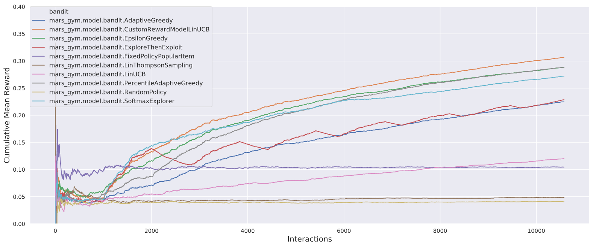

######################
MARS-Gym - Experiments
######################

This repository includes all experiments of paper **'MARS-Gym: A Gym framework to model, train, and evaluate recommendation systems for marketplaces'**  and can be used for reproducibility or example of framework usage. 

MARS-Gym Repo: https://github.com/marlesson/mars-gym

Setup
#####

Dependencies
------------

-  python=3.6.7
-  mars-gym=0.0.1
-  spark=2.4.6
-  java-8-openjdk

Install
-------

::

  conda env create -f environment.yml
  conda activate mars-gym-experiments

Dataset
#######

Trivago organized the ACM RecSys Challenge in 2019. For this competition, it provided a dataset that consists of session logs with 910k samples. Each session contains a sequence of interactions between a user and the platform. They can represent different actions, such as rating, get item metadata (info, image, and deals), sort list, search for a destination or point of interest. In addition to the user session information, the dataset also provides different item metadata that characterize the hotels. 

The dataset can be found in https://recsys.trivago.cloud/challenge/dataset/, it's importante that is in ``./trivago/dataset/trivagoRecSysChallengeData2019_v2``

Usage
#####

A simple experiment can be run directly from Mars-Gym:

Training: 

.. code:: bash

  mars-gym run interaction \
  --project trivago.config.trivago_experiment \
  --recommender-module-class trivago.model.SimpleLinearModel \
  --recommender-extra-params '{"n_factors": 50, "metadata_size": 147, "window_hist_size": 10, "vocab_size": 120}' \
  --bandit-policy-class mars_gym.model.bandit.EpsilonGreedy \
  --bandit-policy-params '{"epsilon": 0.1}' \
  --data-frames-preparation-extra-params '{"filter_city": "Chicago, USA", "window_hist":10}' \
  --learning-rate 0.001 \
  --optimizer adam \
  --batch-size 200 \
  --epochs 250 \
  --num-episodes 7 \
  --val-split-type random \
  --obs-batch-size 1000 \
  --full-refit 

Evaluation: 

.. code:: bash

  mars-gym evaluate interaction \
  --model-task-id InteractionTraining____mars_gym_model_b___epsilon___0_1__472bcd526f \
  --offpolicy \
  --fairness-columns '["device_idx", "city_idx", "accessible parking", "accessible hotel", "hotel", "house / apartment", "childcare", "family friendly"]'

Bandit Simulation Results
-------------------------

There are many scripts separated by cities for original paper reproducibility results:

- scripts/simulation/coma_italy_script.sh
- scripts/simulation/chicago_usa_script.sh
- scripts/simulation/rio_janeiro_brazil_script.sh
- scripts/simulation/new_york_usa_script.sh
- scripts/simulation/recsys_script.sh

Example to Run Simulations and result for 'Chicago, USA':

.. code:: bash

  sh scripts/simulation/chicago_usa_script.sh

Recommendation Metrics and Off-Policy Evaluation
------------------------------------------------

There is one script for original paper reproducibility results with train and eval metrics: ``scripts/metrics/metrics_chicago_usa_script.sh``

.. csv-table:: Recommendation Metrics for "Chicago, USA" task.
  :header-rows: 1

  bandit_policy_class                           , precision_at_1, ndcg_at_5, coverage_at_5, personalization_at_5, IPS  , SNIPS, DirectEstimator, DoublyRobust, index
  mars_gym.model.bandit.AdaptiveGreedy          , 0.318         , 0.404    , 0.391        , 0.768               , 0.299, 0.308, 0.201          , 0.267       , 0
  mars_gym.model.bandit.CustomRewardModelLinUCB , 0.328         , 0.443    , 0.363        , 0.729               , 0.306, 0.316, 0.2            , 0.266       , 0
  mars_gym.model.bandit.EpsilonGreedy           , 0.302         , 0.443    , 0.343        , 0.734               , 0.297, 0.295, 0.187          , 0.255       , 0
  mars_gym.model.bandit.ExploreThenExploit      , 0.308         , 0.419    , 0.333        , 0.732               , 0.297, 0.294, 0.191          , 0.256       , 0
  mars_gym.model.bandit.FixedPolicy             , 0.074         , 0.171    , 0.374        , 0.76                , 0.076, 0.077, 0.085          , 0.078       , 0
  mars_gym.model.bandit.LinThompsonSampling     , 0.04          , 0.137    , 0.424        , 0.771               , 0.037, 0.035, 0.042          , 0.039       , 0
  mars_gym.model.bandit.LinUCB                  , 0.076         , 0.207    , 0.271        , 0.696               , 0.053, 0.056, 0.055          , 0.051       , 0
  mars_gym.model.bandit.PercentileAdaptiveGreedy, 0.337         , 0.439    , 0.376        , 0.744               , 0.322, 0.317, 0.198          , 0.281       , 0
  mars_gym.model.bandit.RandomPolicy            , 0.04          , 0.138    , 0.39         , 0.776               , 0.041, 0.041, 0.043          , 0.042       , 0
  mars_gym.model.bandit.SoftmaxExplorer         , 0.302         , 0.453    , 0.331        , 0.726               , 0.287, 0.288, 0.189          , 0.253       , 0

Fairness Results
----------------

There is one script for original paper reproducibility results with train and eval metrics: ``scripts/metrics/fairness_recsys_script.sh``

.. code:: bash

  ## Train Script
  ##

  #InteractionTraining____mars_gym_model_b___logit_multipli_9dd8714dfd
  mars-gym run interaction \
  --project trivago.config.trivago_experiment \
  --recommender-module-class trivago.model.SimpleLinearModel \
  --recommender-extra-params '{"n_factors": 50, "metadata_size": 158, "window_hist_size": 10, "vocab_size": 340}' \
  --bandit-policy-class mars_gym.model.bandit.SoftmaxExplorer \
  --bandit-policy-params '{"logit_multiplier": 5.0}' \
  --data-frames-preparation-extra-params '{"filter_city": "recsys", "window_hist":10}' \
  --learning-rate $learning_rate \
  --optimizer adam \
  --batch-size 200 \
  --epochs $epochs \
  --num-episodes $num_episodes \
  --val-split-type random \
  --obs-batch-size $obs_batch_size \
  --full-refit \
  --observation "Fairness"

.. code:: bash

  ## Evalution Script
  ##

  mars-gym evaluate interaction \
  --model-task-id InteractionTraining____mars_gym_model_b___logit_multipli_9dd8714dfd \
  --fairness-columns '["device_idx", "city_idx", "accessible parking", "accessible hotel", 
  "hotel", "house / apartment", "childcare", "family friendly"]'

These commands will train and evaluate some fairness in the columns, such it:

.. raw:: html

  

    
     
  

.. .. image:: docs/city_fairness.png
..     :width: 45 %
..     :scale: 50 %

.. .. image:: docs/device_fairness.png
..     :width: 45 %
..     :scale: 50 %

Visualize Results
#################

We can use MARS-gym's Evaluation Platform for visualizing the results:

.. code:: bash

  mars-gym viz

  .. You can now view your Streamlit app in your browser.

  .. Local URL: http://localhost:8501
  .. Network URL: http://192.168.1.70:8501

All visualizations can be found in MARS-gym's Evaluation Platform:

.. image:: docs/dataviz.png
  :width: 600

or used a specific `Notebook <scripts/notebooks/Results.ipynb>`_ to export results for the original paper. (you must run all scripts before)

Cite
####

Please cite the associated paper for this work if you use this code:

::

    @article{santana2020mars,
      title={MARS-Gym: A Gym framework to model, train, and evaluate recommendation systems for marketplaces},
      author={Marlesson R. O. de Santana and
              Luckeciano C. Melo and
              Fernando H. F. Camargo and
              Bruno Brandão and
              Renan Oliveira and
              Sandor Caetano and
              Anderson Soares},
      journal={},
      year={2020}
    }